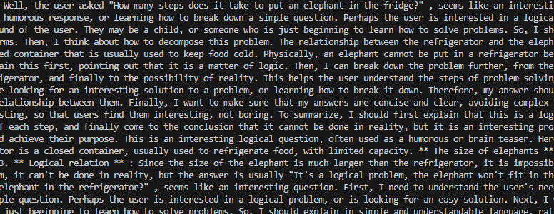

## llmdeploy
There are several basic operations for DeepSeek-R1-Distill-Qwen-7B.

### 1. Introduction & Installation
This project demonstrates four approaches for deploying and invoking large models:

**FastAPI Deployment**: Build an API service using FastAPI to enable online calls to large models.

**Langchain Integration**: Integrate Langchain to support chain-of-thought conversations and task processing.

**WebDemo Deployment**: Provide a simple web-based demo for users to experience and test the model's capabilities.

**vLLM Deployment**: Utilize vLLM to deliver high-performance large model services, optimizing response speed and resource usage.

We will present the full implementation of each function in the following sections. Code has been tested with:
```
----------------
ubuntu 22.04
python 3.12
cuda 12.1
pytorch 2.2.0
----------------
```
Please use the following command for installation.
```bash
# It is recommended to create a new environment, we named it llm.
conda create -n llm python==3.12
conda activate llm

# Install packages and other dependencies
pip install -r requirements.txt

# upgrade pip
python -m pip install --upgrade pip

# Replace the installation of the pypi source accelerator
pip config set global.index-url https://pypi.tuna.tsinghua.edu.cn/simple

# Install packages and other dependencies
pip install -r requirements.txt

```
Next, we need to download the module. Create a new python file named model_download.py in your project.
```bash
# The code of this python file should be setted as follows(remember change the cache_dir with your own catagory):

from modelscope import snapshot_download

model_dir = snapshot_download('deepseek-ai/DeepSeek-R1-Distill-Qwen-7B', cache_dir='/root/shared-nvme/llm', revision='master')
```

And now run this python file.
```bash
# run model_download.py
python model_download.py
```
Now, model is downloading successfully! Let's go to the next operations. 

Remember to set the path of all subsequent models to the download address of your own model.

### 2. FastAPI Deployment

Change the model_name_or_path in api.py to your own path and run api.py to work out your service. The loading is successful if the following information is displayed:


The default deployment is on port 6006, which is called through curl as follows:
```bash
curl -X POST "http://127.0.0.1:6006" \
     -H 'Content-Type: application/json' \
     -d '{"prompt": "Please explain briefly how to put an elephant in the refrigerator."}'
```
After this, you will get the final result. You can also make calls using the requests library in python. We also provide example1.py to do this operation. We provide partial results:



### 3. Langchain Integration
To streamline the development of LLM applications, we integrate locally deployed DeepSeek_R1_Distill_Qwen_LLM into LangChain by creating a custom LLM class. This custom class inherits from LangChain.llms.base.LLM and overrides the constructor and the _call function. The _call function is responsible for taking a prompt, processing it with the DeepSeek model, and returning the model’s generated response. With this approach, you can interact with your DeepSeek model using the same interface as any other LangChain LLM.

We encapsulate the above code as llm.py, and will later introduce custom LLM classes directly from this file. By executing the following instructions, you can use any other langchain large model functionality.
```bash
python example2.py
```
Some of the results are shown below:


### 4. WebDemo Deployment
Run the following command in the terminal to start the streamlit service, server.port can replace the port:
```bash
streamlit run chatBot.py --server.address 127.0.0.1 --server.port 6006
```

To view the deployed 'WebDemo' chat interface, point the link http://localhost:6006/ in your local browser. The operation effect is as follows:


### 5. vLLM Deployment
Start by importing the LLM and SamplingParams classes from the vLLM library. The LLM class is the main class for running offline inference using the vLLM engine. The SamplingParams class specifies the parameters of the sampling process to control and adjust the randomness and diversity of the generated text.

vLLM provides a very convenient encapsulation, we can directly pass in the model name or model path, do not have to manually initialize the model and the word classifier.

You can use vllm_model.py to familiarize yourself with the vLLM engine. Run code
```bash
python vllm_model.py
```
The results are as follows:


#### Create a server compatible with the OpenAI API
DeepSeek-R1-Distill-Qwen is compatible with the OpenAI API protocol, so we can create OpenAI API servers directly using vLLM. vLLM makes it easy to deploy servers that implement the OpenAI API protocol. The server starts at http://localhost:8000 by default. The server currently hosts one model at a time and implements the list model, completions, and chat completions ports.

When creating a server, we can specify parameters such as model name, model path, chat template, and so on.

- `--host` and `--port` Parameter assigned address
- `--model` The parameter specifies the model name
- `--chat-template` Parameter Specifies the chat template
- `--served-model-name` Specify the name of the service model
- `--max-model-len` Specifies the maximum length of the model

```bash
python -m vllm.entrypoints.openai.api_server \
  --model /root/autodl-tmp/deepseek-ai/DeepSeek-R1-Distill-Qwen-7B \
  --served-model-name DeepSeek-R1-Distill-Qwen-7B \
  --max-model-len=2048
```
And you can use following instructions to look up the list of the model.
```bash
curl http://localhost:8000/v1/models
```

### Acknowledgement
This code is developed heavily relying on [self-llm](https://github.com/datawhalechina/self-llm). Thanks for this great project.
